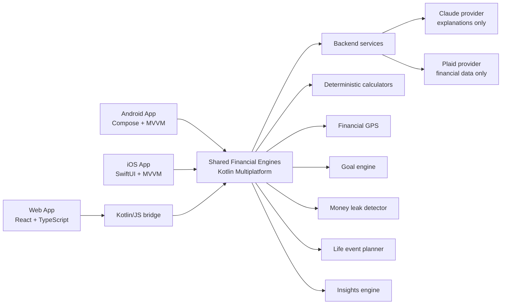

# FutureMe Financial

> An AI-powered financial digital twin that continuously finds risks, opportunities, and better routes through major life decisions.

[](https://github.com/sagrawal2418/futureme-financial-ai/actions/workflows/product-ci.yml)
[](LICENSE)

**Educational simulation only, not financial advice.**

## Why This Exists

Traditional banking apps explain what already happened: balances, transactions, and monthly budgets. They rarely answer the questions customers actually worry about:

- Are we ready to buy a home?
- What should we change before having another child?
- Which financial risk is quietly getting worse?
- How much better could our five-year outlook become?

FutureMe models the household as a living financial system. Deterministic engines calculate the future; AI translates those results into clear next steps.

## Version 2

- **Proactive Insights:** a weekly financial checkup ranked by severity and dollar impact
- **Financial GPS:** current trajectory versus a concrete improved trajectory
- **Goal Readiness:** probability, blockers, actions, monthly gap, and modeled ready date
- **Life Event Planner:** new baby, home purchase, relocation, job loss, parent support, and medical expense
- **Money Leak Detector:** subscriptions, idle cash, high-interest debt, insurance, refinance, and employer match
- **Scenario Lab:** seven scenario families with deterministic five-year comparisons
- **FutureMe Assistant:** contextual explanations grounded in shared engine output
- **Realistic Demo Data:** account inventory and 90 days of transaction history

Android, iOS, and web receive the same `ProductBootstrap` from the Kotlin Multiplatform core. No platform owns a separate formula implementation.

## Screenshots

| Android | iOS | Web |
| --- | --- | --- |
|  |  |  |

Release captures can replace these placeholders without changing documentation layout.

## Architecture



The backend never replaces the financial core. Claude receives structured, already-calculated outputs and cannot alter balances, probabilities, or projections.

See [Architecture](docs/architecture.md), [Client Feature Parity](docs/feature-parity.md), [LLM Architecture](docs/llm-architecture.md), and [Security Architecture](docs/security-architecture.md).

## Repository

```text
apps/
├── android/                 # Native Jetpack Compose
├── ios/                     # Native SwiftUI + Charts
└── web/                     # React + TypeScript
shared/
├── domain/                  # Product facade and provider contracts
├── models/                  # Serializable cross-platform contracts
├── calculators/             # Pure financial formulas
├── scenario-engine/         # Five-year simulation and comparison
├── financial-gps/           # Current versus improved trajectory
├── goal-engine/             # Goal readiness probability
├── money-leak-detector/     # Deterministic opportunity rules
├── life-event-planner/      # Life-event cost and preparation plans
├── insights-engine/         # Proactive insight ranking
├── ai-assistant/            # Grounded mock explanation layer
├── mock-data/               # Canonical household and 90-day history
├── design-system/           # Shared visual semantics
└── web-bridge/              # Kotlin/JS JSON exports
backend/
├── api/                     # OpenAPI transport contract
├── services/                # Application orchestration
├── providers/               # LLM and Plaid boundaries
├── normalizers/             # Provider-to-domain mapping
└── tests/                   # Provider and normalizer tests
docs/
```

## Demo Household

The Lee household includes two incomes, one dependent, childcare, insurance, subscriptions, utilities, mortgage, credit cards, auto debt, retirement accounts, brokerage assets, checking, and an emergency reserve.

Seeded totals:

- $242,000 annual gross income
- $14,250 monthly take-home income
- $96,500 liquid savings
- $18,400 credit-card debt
- $451,000 mortgage on a $735,000 home
- $286,000 invested
- 90 dated mock transactions from March 13 through June 10, 2026

## Demo Flow

1. Open **This Week's Financial Checkup** and review the top three proactive insights.
2. Compare the **Financial GPS** current and improved five-year trajectories.
3. Open **Money Leaks** and inspect the annual and five-year impact.
4. Review **Goal Readiness** for a larger home and another child.
5. Open **Life Event Planner**, select **Welcome a new baby**, and plan the linked scenario.
6. Compare **Move to Austin** versus **Stay in New Jersey**.
7. Ask, “What is my biggest money leak?” and “How can I improve my 5-year outlook?”

The assistant repeats shared structured output; it does not perform financial arithmetic.

## Claude Architecture

`LlmProvider` is backend-only:

- `MockLlmProvider` runs in Version 2.
- `AnthropicLlmProvider` builds requests but does not send them.
- Sonnet is the default explanation strategy.
- Opus is reserved for complex scenario reasoning.
- Haiku is reserved for short insight summaries.
- API keys belong only in backend secret storage.

See [docs/llm-architecture.md](docs/llm-architecture.md).

## Plaid Architecture

`PlaidProvider` exposes link-token, token exchange, account, transaction, liability, and investment methods.

- `MockPlaidProvider` returns safe local records.
- `PlaidSandboxProvider` is an explicit non-operational placeholder.
- `FinancialDataNormalizer` maps provider records into shared-compatible profile, transaction, cash, debt, mortgage, and investment shapes.
- Access tokens are never returned to a client.

See the endpoint contract in [backend/api/openapi.yaml](backend/api/openapi.yaml).

## Setup

Requirements:

- JDK 17
- Android Studio with Android SDK 36
- Node.js 22.12 or newer
- Xcode 16 or newer
- Python 3.12 for backend tests

Use Android Studio's bundled JDK on macOS when needed:

```bash
export JAVA_HOME="/Applications/Android Studio.app/Contents/jbr/Contents/Home"
```

Shared core and Android:

```bash
./gradlew :shared:testDebugUnitTest :apps:android:assembleDebug
```

iOS:

```bash
open apps/ios/FutureMeFinancial.xcodeproj
```

Web:

```bash
cd apps/web
npm install
npm run dev
```

Backend tests:

```bash
python3 -m unittest discover -s backend/tests -v
```

Full local verification:

```bash
./gradlew :shared:testDebugUnitTest :shared:compileKotlinIosSimulatorArm64 :apps:android:assembleDebug
cd apps/web && npm test && npm run build
cd ../.. && python3 -m unittest discover -s backend/tests -v
```

## Test Coverage

Shared tests cover formulas, scenarios, all seven scenario families, proactive insights, Financial GPS, goal probability, life-event planning, money-leak detection, assistant grounding, and 90-day demo-data reconciliation.

Backend tests cover:

- Mock LLM explanations
- Anthropic model routing and request generation
- Mock Plaid data and token handling
- Financial data normalization

Web tests verify the generated Kotlin/JS bridge. A client parity contract test guards the synchronized Version 2 capability set. GitHub Actions builds Android, web, the native iOS simulator app, and the backend provider suite.

## Roadmap

Version 3 priorities:

1. Editable synchronized profiles and custom goal inputs
2. Versioned assumption sets and Monte Carlo confidence bands
3. Authenticated backend persistence with consent and audit events
4. Plaid Sandbox integration behind token vaulting
5. Claude evaluation harness, prompt registry, and citation UI
6. Real-time cash-flow, rate, and goal-drift alerts
7. Banker-assisted and white-label enterprise workflows

See [docs/roadmap.md](docs/roadmap.md).

## Privacy

This prototype uses mock data only. It stores no real bank credentials, Plaid access tokens, Claude API keys, or customer account numbers. See [SECURITY.md](SECURITY.md).

## License

[MIT](LICENSE)
