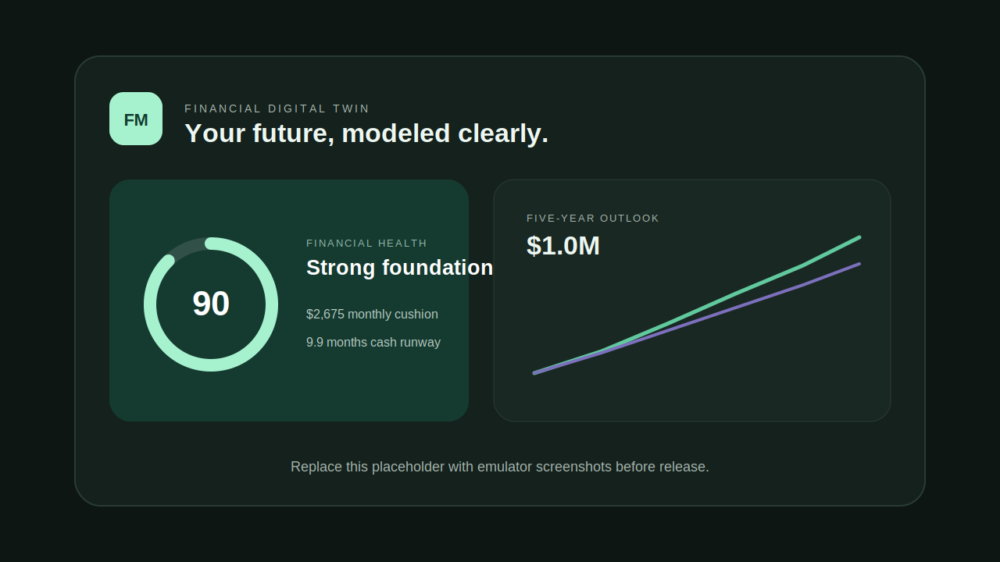
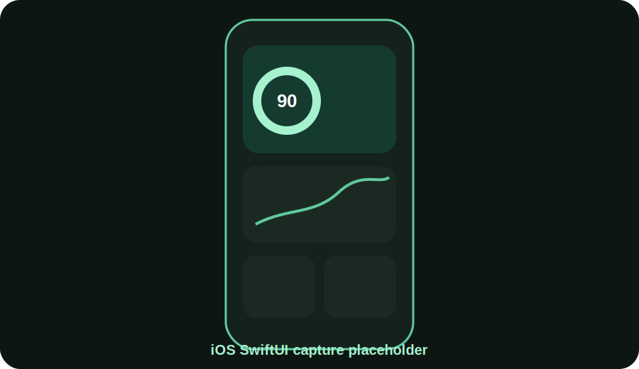
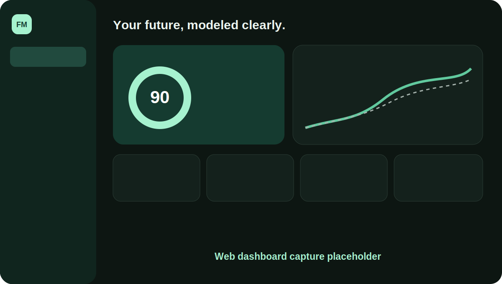
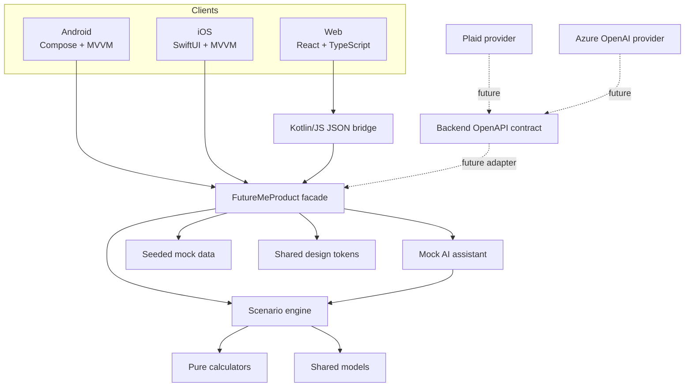

# FutureMe Financial

> A cross-platform financial digital twin that helps households simulate major decisions before they commit.

[](https://github.com/sagrawal2418/futureme-financial-ai/actions/workflows/product-ci.yml)
[](LICENSE)

**Educational simulation only, not financial advice.**

## Product

Traditional finance apps explain the past. FutureMe models the future.

The seeded demo household can test buying a home, refinancing, paying off debt, losing a job, relocating, having a child, or investing more. Every client presents the same monthly cash-flow impact, emergency runway, debt timeline, five-year net-worth projection, health score, risk factors, tradeoffs, and recommendation.

The MVP uses mock data only. It has no Plaid dependency, bank credentials, customer PII, or live AI call.

## Highlights

- Native Android with Jetpack Compose and MVVM
- Native iOS with SwiftUI and Apple Charts
- Responsive React and TypeScript web dashboard
- Kotlin Multiplatform core shared by every client
- Seven scenario families with side-by-side comparison
- Explainable health and risk scores
- Scenario-aware mock AI assistant with free-form questions
- Loading, empty, error, dark-mode, and accessible UI states
- Pure unit-tested financial calculations
- Encryption-ready secure storage boundary
- OpenAPI contract for future backend adapters

## Screenshots

| Android | iOS | Web |
| --- | --- | --- |
|  |  |  |

Replace the placeholders with release captures as the product evolves.

## Architecture



Financial figures are produced only by `shared/calculators` and `shared/scenario-engine`. AI explains calculator output; it never invents balances or projections.

See [Architecture](docs/architecture.md), [Product Vision](docs/product-vision.md), and [Roadmap](docs/roadmap.md).

## Repository

```text
apps/
├── android/                  # Jetpack Compose presentation
├── ios/                      # SwiftUI presentation
└── web/                      # React dashboard
shared/
├── models/                   # Cross-platform contracts
├── calculators/              # Pure financial formulas
├── scenario-engine/          # Projection and comparison policy
├── mock-data/                # One canonical demo household
├── ai-assistant/             # Deterministic mock assistant
├── design-tokens/            # Shared visual semantics
├── domain/                   # Product facade and common tests
└── web-bridge/               # Kotlin/JS JSON boundary
backend/
├── api/                      # OpenAPI contract
├── services/                 # Future provider boundaries
└── mock-ai/                  # Mock AI service notes
docs/
```

The logical shared directories compile as one KMP Gradle module, `:shared`, so Android, iOS, and JavaScript receive the same implementation.

## Demo

The `Lee household` starts with:

- $242,000 gross annual income
- $14,250 monthly take-home income
- $96,500 liquid savings
- $18,400 credit-card debt at 20.99% APR
- $735,000 property value and $451,000 mortgage
- $286,000 invested and $1,850 monthly retirement contribution

Try **Move to Austin, TX vs Stay in New Jersey**. The same comparison object and risk-adjusted recommendation render in all three clients. Then ask the assistant, “Should I pay off debt or invest more?”

## Setup

### Requirements

- JDK 17
- Android Studio with Android SDK 36
- Node.js 22.12 or newer
- Xcode 16 or newer for the iOS app

If macOS cannot find Java, use Android Studio's bundled JDK:

```bash
export JAVA_HOME="/Applications/Android Studio.app/Contents/jbr/Contents/Home"
```

### Shared core and Android

```bash
./gradlew :shared:testDebugUnitTest
./gradlew :apps:android:assembleDebug
```

Open the repository root in Android Studio and run `apps:android`.

### iOS

```bash
open apps/ios/FutureMeFinancial.xcodeproj
```

Select an iPhone simulator and run `FutureMeFinancial`. The Xcode build phase compiles and embeds the KMP framework automatically.

If Command Line Tools are selected instead of Xcode:

```bash
sudo xcode-select -s /Applications/Xcode.app/Contents/Developer
```

### Web

```bash
./gradlew :shared:jsBrowserProductionLibraryDistribution
cd apps/web
npm install
npm run dev
```

`npm run dev` builds the Kotlin/JS package before starting Vite. Open [http://localhost:5173](http://localhost:5173).

### Verification

```bash
./gradlew :shared:testDebugUnitTest :apps:android:assembleDebug
cd apps/web && npm test && npm run build
```

## Testing

Shared tests cover:

- Monthly cash flow and emergency runway
- Monthly compounding
- Debt payoff and negative amortization
- Net worth and annual projection points
- Health and explainable risk scoring
- Scenario comparison policy
- All seven scenario families
- Scenario-aware assistant responses

Web tests verify the generated Kotlin/JS contract. Android and iOS intentionally contain no duplicate formula implementation.

## Privacy

- Mock data only
- No account numbers, tokens, or real credentials
- Identity is separated from financial profile data
- Android application DI and iOS Keychain abstractions are provider-ready
- Future bank and AI adapters remain outside the deterministic calculation core

See [SECURITY.md](SECURITY.md).

## Roadmap

1. Editable, validated profiles and custom scenarios
2. Encrypted local persistence and consent controls
3. Monte Carlo ranges and versioned assumptions
4. Opt-in Plaid aggregation through a governed backend
5. Azure OpenAI explanations grounded in signed calculator output
6. Real-time alerts and refinance/debt opportunities
7. Enterprise banking workflows, audit, tenancy, and model-risk governance

## Contributing

Read [CONTRIBUTING.md](CONTRIBUTING.md) and [CODE_OF_CONDUCT.md](CODE_OF_CONDUCT.md). Licensed under the [MIT License](LICENSE).
