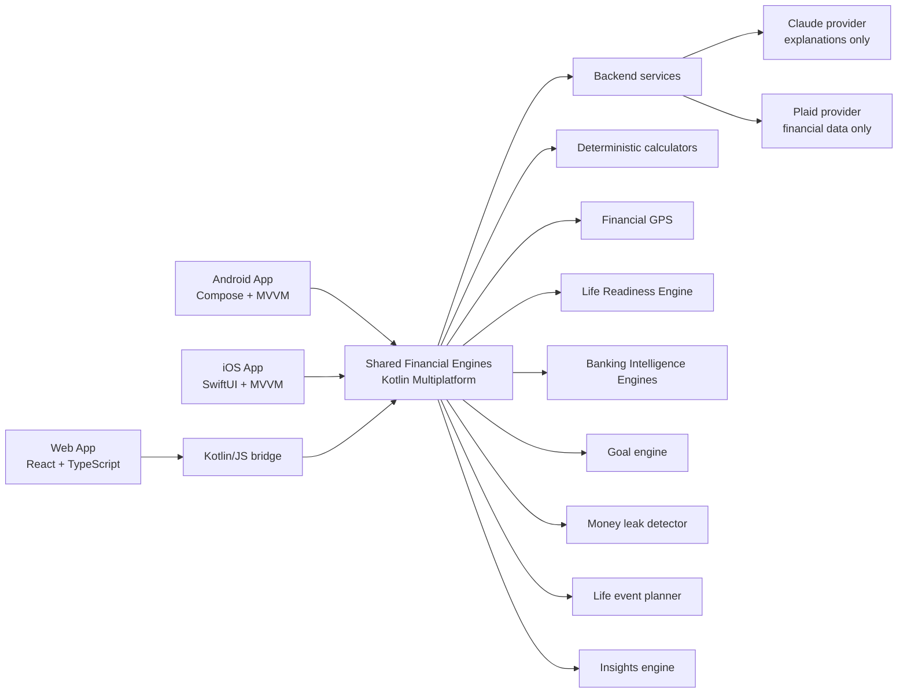

# FutureMe Financial

> FutureMe Financial is an AI-powered Banking Intelligence and Life Readiness Platform that helps families understand how prepared they are for major decisions and what action matters most next.

[](https://github.com/sagrawal2418/futureme-financial-ai/actions/workflows/product-ci.yml)
[](https://github.com/sagrawal2418/futureme-financial-ai/actions/workflows/deploy-pages.yml)
[](LICENSE)

**Educational simulation only, not financial advice.**

[Open the live web app](https://sagrawal2418.github.io/futureme-financial-ai/)

## Why This Exists

Traditional banking apps explain what already happened: balances, transactions, and monthly budgets. They rarely answer the questions customers actually worry about:

- Are we ready to buy a home?
- What should we change before having another child?
- Which financial risk is quietly getting worse?
- How much better could our five-year outlook become?

FutureMe models the household as a living financial system. Deterministic engines calculate readiness and future impact; AI translates those results into clear next steps.

## Version 4: Banking Intelligence

- **Financial Opportunity Ranking Engine:** ranks recommendations from debt, investments, money leaks, goals, readiness, Financial GPS, and life events by impact, effort, confidence, and modeled benefit
- **Single Next Best Action:** answers, “If I can only do one thing this month, what should it be?”
- **Financial Health Explainability:** reconciles score changes to positive and negative factors
- **Scenario Impact Heatmap:** shows cash-flow, debt, emergency-fund, retirement, readiness, and risk effects
- **Monthly Financial Review:** stores wins, risks, opportunities, actions, readiness movement, goal progress, and an AI summary
- **Financial Decision Journal:** tracks expected versus actual outcomes
- **What Improved My Future:** attributes modeled future net-worth improvement to prior actions
- **FutureMe Banking Vision:** a seven-step executive demo for portfolio, leadership, innovation, and patent discussions
- **Local Analytics:** records scenario, goal, insight, recommendation, readiness, AI, and review events without a remote analytics provider

Android, iOS, and web consume the same banking intelligence models and calculations from `FutureMeProduct`.

## Version 3: Life Readiness Intelligence

- **Life Readiness Engine:** shared 0-100 readiness scores for home purchase, children, relocation, retirement, business startup, parent support, and education funding
- **Readiness Dashboard:** decision-level scores, trends, blockers, confidence, and estimated ready dates
- **Life Decision Simulator:** readiness, cash-flow, net-worth, risk, and timeline impact for major choices
- **Readiness Improvement Plans:** current-to-target plans with sequenced actions, monthly commitment, and projected target date
- **FutureMe AI Coach:** a financial strategist grounded in shared readiness, scenario, and risk output
- **Life Timeline:** today, six-month, one-year, three-year, and five-year views of readiness, net worth, debt, investments, and completed goals
- **Executive Demo:** a guided dual-income family experience covering home, child, relocation, coaching, and an improvement plan

Android, iOS, and web receive the same `ProductBootstrap` from the Kotlin Multiplatform core. No platform owns a separate readiness or financial formula implementation.

## Why Banks Could Adopt This

Current banking apps focus on transactions: what was spent, where it went, and what the balance is today.

FutureMe focuses on financial decision intelligence:

- Prioritize the one action with the highest modeled customer value
- Explain score movement and recommendation logic
- Connect products to customer life decisions rather than generic campaigns
- Measure whether accepted recommendations improved outcomes
- Give customers and bankers a shared, auditable planning view
- Keep calculations deterministic while using AI only for explanation

This creates a path from passive account servicing to proactive financial guidance without making the language model the system of record.

## Version 2 Foundation

- **Proactive Insights:** a weekly financial checkup ranked by severity and dollar impact
- **Financial GPS:** current trajectory versus a concrete improved trajectory
- **Goal Readiness:** probability, blockers, actions, monthly gap, and modeled ready date
- **Life Event Planner:** new baby, home purchase, relocation, job loss, parent support, and medical expense
- **Money Leak Detector:** subscriptions, idle cash, high-interest debt, insurance, refinance, and employer match
- **Scenario Lab:** nine scenario families with deterministic five-year comparisons
- **FutureMe Assistant:** contextual explanations grounded in shared engine output
- **Realistic Demo Data:** account inventory and 90 days of transaction history

## Screenshots

| Android | iOS | Web |
| --- | --- | --- |
|  |  |  |

Release captures can replace these placeholders without changing documentation layout.

## Architecture



The backend never replaces the financial core. Claude receives structured, already-calculated outputs and cannot alter balances, probabilities, or projections.

See [Banking Vision](docs/banking-vision.md), [Future Banking Roadmap](docs/future-banking-roadmap.md), [Life Readiness Framework](docs/life-readiness-framework.md), [Architecture](docs/architecture.md), [Client Feature Parity](docs/feature-parity.md), and [Security Architecture](docs/security-architecture.md).

## Repository

```text
apps/
├── android/                 # Native Jetpack Compose
├── ios/                     # Native SwiftUI + Charts
└── web/                     # React + TypeScript
shared/
├── domain/                  # Product facade and provider contracts
├── models/                  # Serializable cross-platform contracts
├── calculators/             # Pure financial formulas
├── life-readiness-engine/   # Readiness, decision impact, plans, and timeline
├── banking-intelligence/    # Opportunity ranking, explainability, reviews, heatmaps, and outcomes
├── scenario-engine/         # Five-year simulation and comparison
├── financial-gps/           # Current versus improved trajectory
├── goal-engine/             # Goal readiness probability
├── money-leak-detector/     # Deterministic opportunity rules
├── life-event-planner/      # Life-event cost and preparation plans
├── insights-engine/         # Proactive insight ranking
├── ai-assistant/            # Grounded mock explanation layer
├── mock-data/               # Canonical household and 90-day history
├── design-system/           # Shared visual semantics
└── web-bridge/              # Kotlin/JS JSON exports
backend/
├── api/                     # OpenAPI transport contract
├── services/                # Application orchestration
├── providers/               # LLM and Plaid boundaries
├── normalizers/             # Provider-to-domain mapping
└── tests/                   # Provider and normalizer tests
docs/
```

## Demo Household

The Lee household includes two incomes, one dependent, childcare, insurance, subscriptions, utilities, mortgage, credit cards, auto debt, retirement accounts, brokerage assets, checking, and an emergency reserve.

Seeded totals:

- $242,000 annual gross income
- $14,250 monthly take-home income
- $96,500 liquid savings
- $18,400 credit-card debt
- $451,000 mortgage on a $735,000 home
- $286,000 invested
- 90 dated mock transactions from March 13 through June 10, 2026

## Demo Flow

1. Open **My Highest Impact Action** and show the modeled five-year value.
2. Review the ranked opportunities and explain why the top action wins.
3. Show **Why My Score Changed** and its factor-level point impacts.
4. Use the **Life Decision Simulator** and review its six-dimension heatmap.
5. Save the decision and compare expected versus actual outcomes in the journal.
6. Open the **Monthly Financial Review** and **What Improved My Future?**
7. Ask the AI Coach, “If I can only do one thing this month, what should it be?”
8. Finish with the seven-step **FutureMe Banking Vision** demo.

The coach explains shared structured output; it does not perform financial arithmetic.

## Claude Architecture

`LlmProvider` is backend-only:

- `MockLlmProvider` runs in Version 2.
- `AnthropicLlmProvider` builds requests but does not send them.
- Sonnet is the default explanation strategy.
- Opus is reserved for complex scenario reasoning.
- Haiku is reserved for short insight summaries.
- API keys belong only in backend secret storage.

See [docs/llm-architecture.md](docs/llm-architecture.md).

## Plaid Architecture

`PlaidProvider` exposes link-token, token exchange, account, transaction, liability, and investment methods.

- `MockPlaidProvider` returns safe local records.
- `PlaidSandboxProvider` is an explicit non-operational placeholder.
- `FinancialDataNormalizer` maps provider records into shared-compatible profile, transaction, cash, debt, mortgage, and investment shapes.
- Access tokens are never returned to a client.

See the endpoint contract in [backend/api/openapi.yaml](backend/api/openapi.yaml).

## Setup

Requirements:

- JDK 17
- Android Studio with Android SDK 36
- Node.js 22.12 or newer
- Xcode 16 or newer
- Python 3.12 for backend tests

Use Android Studio's bundled JDK on macOS when needed:

```bash
export JAVA_HOME="/Applications/Android Studio.app/Contents/jbr/Contents/Home"
```

Shared core and Android:

```bash
./gradlew :shared:testDebugUnitTest :apps:android:assembleDebug
```

iOS:

```bash
open apps/ios/FutureMeFinancial.xcodeproj
```

Web:

```bash
cd apps/web
npm install
npm run dev
```

Backend tests:

```bash
python3 -m unittest discover -s backend/tests -v
```

Full local verification:

```bash
./gradlew :shared:testDebugUnitTest :shared:compileKotlinIosSimulatorArm64 :apps:android:assembleDebug
cd apps/web && npm test && npm run build
cd ../.. && python3 -m unittest discover -s backend/tests -v
```

## Test Coverage

Shared tests cover formulas, nine scenario families, readiness, opportunity ranking, next-best-action selection, score explainability, heatmaps, monthly reviews, decision journaling, analytics, outcome attribution, coach grounding, and 90-day demo-data reconciliation.

Backend tests cover:

- Mock LLM explanations
- Anthropic model routing and request generation
- Mock Plaid data and token handling
- Financial data normalization

Web tests verify the generated Kotlin/JS bridge. A client parity contract test guards the synchronized product capability set. GitHub Actions builds Android, web, the native iOS simulator app, and the backend provider suite.

## Roadmap

The next stages add governed data connectivity, recommendation policy controls, banker-assisted workflows, and measurable outcome learning.

See [Future Banking Roadmap](docs/future-banking-roadmap.md) and [Engineering Roadmap](docs/roadmap.md).

## Privacy

This prototype uses mock data only. It stores no real bank credentials, Plaid access tokens, Claude API keys, or customer account numbers. See [SECURITY.md](SECURITY.md).

## License

[MIT](LICENSE)
