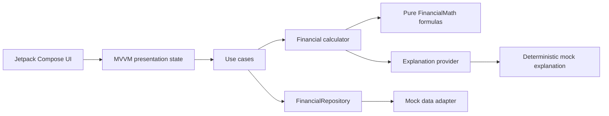

# FutureMe Financial

> An AI-ready financial digital twin that helps people understand the long-term impact of major life decisions before they commit.


**Educational simulation only, not financial advice.**

## Problem statement

Most consumer finance tools report what already happened. They show balances, transactions, and budgets, but they do not help a household reason clearly about decisions such as relocating, refinancing, eliminating debt, growing a family, or investing more.

Those decisions combine cash flow, liquidity, debt, assets, risk, and time. Spreadsheet modeling is difficult to maintain, while black-box recommendations are hard to trust.

## Solution overview

FutureMe Financial creates a deterministic financial digital twin from mock household data. Users can run structured what-if scenarios and compare:

- Monthly cash-flow impact
- Emergency-fund runway
- Debt-payoff estimate
- One-, three-, and five-year net-worth projections
- Financial health score
- Explainable risk score and contributing factors
- Plain-English mock recommendation

The MVP is intentionally local-first. It uses no bank credentials, no Plaid connection, and no real customer data. The explanation layer is replaceable, but financial figures always come from tested formulas.

## Key features

- Polished Jetpack Compose dashboard
- Mock household financial profile
- Scenario list and detailed simulation results
- Side-by-side scenario comparison with projection chart
- Transparent financial health and risk scoring
- Loading, empty, and recoverable error states
- System-aware light and dark themes
- Accessibility labels for scores, charts, navigation, and scenarios
- Clean Architecture boundaries with MVVM presentation
- Pure unit-tested financial formulas
- GitHub Actions build and test workflow

## Architecture overview



The dependency direction points inward. UI code does not calculate financial results, and data adapters do not own business rules.

See [docs/architecture.md](docs/architecture.md) for package boundaries, state flow, assumptions, and extension points.

## Tech stack

| Area | Technology |
| --- | --- |
| Language | Kotlin |
| UI | Jetpack Compose + Material 3 |
| Presentation | MVVM with explicit UI state |
| Architecture | Clean Architecture + repository/use-case boundaries |
| Dependency injection | Lightweight manual application container |
| Testing | JUnit 4 |
| Build | Gradle Kotlin DSL + version catalog |
| CI | GitHub Actions |

## Repository structure

```text
.
├── app/src/main/kotlin/com/futureme/financialai/
│   ├── data/          # Mock adapters and dependency container
│   ├── domain/        # Pure financial formulas and calculator
│   ├── model/         # Immutable domain models
│   ├── presentation/  # ViewModel and UI state
│   ├── repository/    # Repository contracts
│   ├── usecase/       # Application orchestration
│   ├── ui/            # Compose screens, components, and theme
│   └── util/          # Formatting helpers
├── docs/
└── .github/workflows/
```

## Demo scenario

The seeded `Lee household` profile includes:

- $242,000 annual gross income
- $14,250 monthly take-home income
- $96,500 liquid savings
- $18,400 credit-card debt at 20.99% APR
- Mortgage, home equity, retirement contributions, investments, and one dependent

Example: **Move to Austin, TX**

The simulator models lower recurring housing costs, a modest income adjustment, moving costs, five-year net-worth impact, reserve runway, and relocation risk. The comparison screen evaluates that path against paying off high-interest debt using the same assumptions.

Additional scenarios cover refinancing, having a child, increasing investments, and a six-month job loss.

## Screenshots

| Dashboard | Scenario detail | Comparison |
| --- | --- | --- |
| Replace with emulator capture | Replace with emulator capture | Replace with emulator capture |

Screenshot assets belong in `docs/screenshots/`.

## Setup instructions

### Requirements

- Android Studio with Android SDK 36
- JDK 17
- Android 8.0 or newer emulator/device

### Android Studio

1. Clone the repository.
2. Open the repository root in Android Studio.
3. Allow Gradle sync to complete.
4. Run the `app` configuration.

### Command line

```bash
./gradlew testDebugUnitTest
./gradlew assembleDebug
```

The debug APK is generated at:

```text
app/build/outputs/apk/debug/app-debug.apk
```

## Testing strategy

`FinancialMathTest` covers:

- Monthly cash flow
- Emergency-fund runway
- Debt-payoff logic and negative amortization
- Five-year net-worth projection
- Risk-score factors, severity, and score cap

The domain is deterministic so test failures describe calculation changes rather than network or AI variability.

## Roadmap

1. Add editable profile and scenario inputs with validation.
2. Persist local profiles and scenarios using encrypted storage.
3. Add Monte Carlo ranges and versioned assumption policies.
4. Introduce a governed Azure OpenAI explanation adapter grounded only in calculator output.
5. Extract shared domain logic for native iOS and a web dashboard.
6. Add opt-in Plaid connectivity only after consent, security, and compliance foundations are complete.

See [docs/roadmap.md](docs/roadmap.md) for milestones and enterprise banking opportunities.

## Privacy and security

- Mock data only
- No real bank credentials
- No Plaid dependency
- No account numbers or access tokens
- Financial calculations remain independent of any future AI provider
- Security reports follow [SECURITY.md](SECURITY.md)

## Contributing

Read [CONTRIBUTING.md](CONTRIBUTING.md) and [CODE_OF_CONDUCT.md](CODE_OF_CONDUCT.md) before opening a pull request.

## License

Licensed under the [MIT License](LICENSE).
