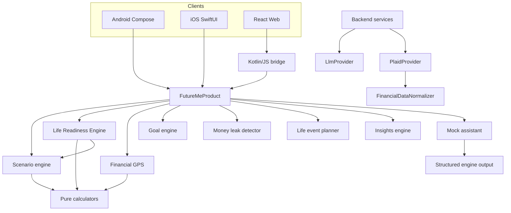

# Architecture

## Decision

FutureMe Financial uses native Android and iOS presentation, React on web, and one Kotlin Multiplatform financial product core. Platform code owns rendering, navigation, accessibility, and secure-storage implementations. Shared code owns every financial model, deterministic calculation, recommendation input, and seeded demo record.

## Boundaries

| Module | Responsibility |
| --- | --- |
| `shared/models` | Serializable profile, account, transaction, insight, goal, event, scenario, readiness, timeline, GPS, and coach contracts |
| `shared/calculators` | Pure formulas |
| `shared/life-readiness-engine` | Readiness scoring, improvement plans, decision impact, and life timeline |
| `shared/scenario-engine` | Five-year projection and comparison policy |
| `shared/financial-gps` | Current versus improved trajectory |
| `shared/goal-engine` | Deterministic goal-readiness probability |
| `shared/money-leak-detector` | Rule-based opportunity detection |
| `shared/life-event-planner` | Cost ranges and preparation plans |
| `shared/insights-engine` | Proactive ranking and next actions |
| `shared/ai-assistant` | Mock explanations of structured outputs |
| `shared/mock-data` | Canonical household, accounts, scenarios, and 90-day transactions |
| `shared/design-system` | Cross-platform visual semantics |
| `shared/domain` | `FutureMeProduct` facade |
| `shared/web-bridge` | JSON boundary for React |
| `backend/providers` | Claude and Plaid interfaces |
| `backend/normalizers` | External data to domain-compatible records |
| `apps/*` | Presentation only |

## Dependency Flow

## Determinism Rule

Calculators and engines produce all dollar values, scores, probabilities, dates, rankings, and projections. The assistant can summarize these values but cannot calculate replacements.

## Client Integration

- Android uses `FutureMeViewModel` and immutable Compose state.
- iOS calls the generated `Shared` framework from `FutureMeViewModel`.
- Web parses the serialized `ProductBootstrap` from Kotlin/JS.

Every client renders `readiness`, `readinessPlans`, `decisionSimulations`, `lifeTimeline`, `executiveDemo`, and the Version 2 financial foundation from the same bootstrap.

The synchronized presentation contract is documented in [feature-parity.md](feature-parity.md). Platform-native navigation is encouraged, but all clients must expose equivalent inputs, outputs, and user actions.

## Projection Policy

The scenario engine projects monthly for 60 months, compounds investments, applies a documented property-appreciation assumption, services revolving debt, and emits annual points. The Life Readiness Engine combines profile ratios with those scenario results to produce decision-specific scores, impacts, plans, and timeline points. The Financial GPS adds the deterministic effect of three explicit actions: reduce spending by $250, invest $200 more, and pay $300 more toward high-interest debt.

## Extension Points

- Replace `MockFinancialDataProvider` with normalized backend data.
- Replace `MockLlmProvider` with Anthropic transport.
- Replace `MockPlaidProvider` with Plaid Sandbox.
- Add encrypted persistence without changing financial engines.
- Add alert delivery downstream of insights.
