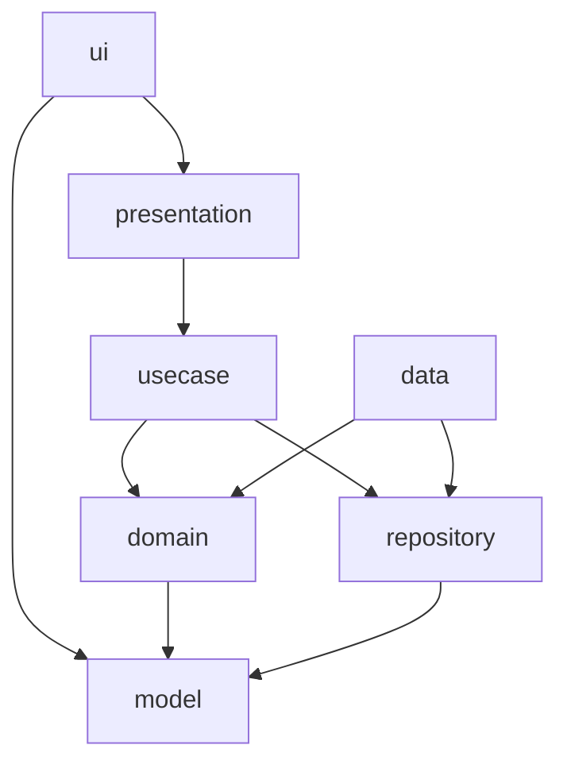

# Architecture

## Goals

- Keep financial behavior deterministic, explainable, and testable.
- Keep Android UI native and presentation state explicit.
- Separate business rules from mock data and framework code.
- Make future AI and financial-data providers replaceable.
- Preserve a straightforward path toward Kotlin Multiplatform.

## Package boundaries

| Package | Responsibility |
| --- | --- |
| `model` | Immutable financial entities and result models |
| `domain` | Pure formulas, projections, risk policy, and provider contracts |
| `repository` | Financial data access contracts |
| `data` | Mock data, repository adapters, mock explanation provider, DI container |
| `usecase` | Application-level orchestration |
| `presentation` | ViewModel, navigation state, loading/content/empty/error state |
| `ui` | Compose screens, reusable components, accessibility, and theme |
| `util` | Display-only formatting helpers |

## Dependency flow

The `domain` package has no Android or Compose dependencies. Financial calculations can therefore move into a future shared module without rewriting the UI.

## Presentation state

`FutureMeUiState` represents:

- `Loading`
- `Content`
- `Empty`
- `Error`

Content navigation is represented by `FutureMeScreen`. The MVP avoids a navigation framework to keep the sample focused; replacing this state with Navigation Compose does not change domain or use-case APIs.

## Calculation policy

The five-year projection:

1. Starts with liquid savings, investments, property, mortgage, and revolving debt.
2. Applies scenario upfront and balance-sheet changes.
3. Projects monthly cash flow for 60 months.
4. Compounds investments monthly.
5. Uses a simplified 3% annual property appreciation assumption.
6. Uses a simplified mortgage-principal allocation.
7. Services revolving debt using APR and scheduled payment.
8. Emits annual points for years 0 through 5.

The model intentionally simplifies taxes, transaction costs, rate changes, market volatility, and state-specific policy.

## Explainable risk

Risk is computed from visible factors:

- Base planning uncertainty
- Scenario complexity
- Monthly cash-flow pressure
- Emergency reserve coverage
- High-interest debt
- Upfront liquidity draw

The score is bounded from 5 to 95 and mapped to low, moderate, elevated, or high risk. AI is not involved in the score.

## Provider strategy

`FinancialRepository` can later be implemented by:

- An encrypted local database
- A backend API
- An opt-in account aggregation adapter

`FinancialExplanationProvider` can later be implemented by a governed AI service. It should receive calculator outputs, assumption versions, and approved context only.

## Future platform expansion

The code contains a TODO to move immutable models, formulas, and use cases into Kotlin Multiplatform when iOS and web clients are introduced. Compose screens remain Android-specific; SwiftUI and React should consume the same business contracts.
