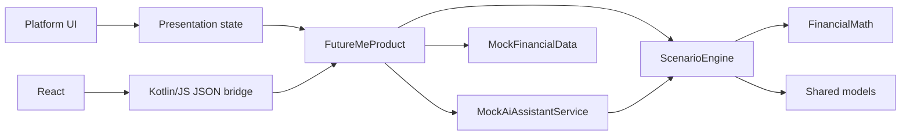

# Architecture

## Decision

FutureMe Financial uses native presentation on Android and iOS, React on web, and a Kotlin Multiplatform product core.

The core is deterministic and provider-independent. It owns models, formulas, projection policy, scenario comparison, seeded data, design semantics, and the mock assistant. Clients own rendering, navigation, platform accessibility, and secure-storage implementations.

## Boundaries

| Boundary | Responsibility | Must not own |
| --- | --- | --- |
| `shared/models` | Serializable product contracts | Calculations or UI |
| `shared/calculators` | Pure formulas | Framework APIs |
| `shared/scenario-engine` | Projection, tradeoff, and comparison policy | Client state |
| `shared/mock-data` | Canonical demo profile and scenarios | Production credentials |
| `shared/ai-assistant` | Grounded mock explanations | Financial arithmetic |
| `shared/design-tokens` | Cross-platform visual semantics | Platform widgets |
| `shared/domain` | `FutureMeProduct` facade and common tests | Presentation |
| `shared/web-bridge` | JSON exports for React | Business rules |
| `apps/*` | Native/responsive presentation | Formula forks |
| `backend/*` | Future transport and provider contracts | A second calculator |

## Dependency flow

Dependencies point toward shared business policy. Platform modules can be replaced without changing calculation behavior.

## Client integration

### Android

`FutureMeApplication` provides one `FutureMeProduct`. `FutureMeViewModel` translates shared models into navigation and chat state. Compose screens render immutable shared results.

### iOS

`FutureMeViewModel` owns SwiftUI state and calls the generated `Shared` framework. `KeychainSecureStore` demonstrates a platform secure-storage boundary while demo financial values remain in memory.

### Web

Kotlin/JS exports four JSON operations: bootstrap, simulate, compare, and ask. `src/shared.ts` is a typed serialization adapter. It mirrors contracts only and contains no formulas.

## Calculation policy

The five-year engine:

1. Builds opening cash, investments, property, mortgage, and revolving debt.
2. Applies scenario upfront and balance-sheet changes.
3. Projects cash flow monthly for 60 months.
4. Compounds investments monthly.
5. Applies a documented 3% property-appreciation assumption.
6. Uses a simplified mortgage-principal allocation.
7. Services revolving debt with APR and scheduled payment.
8. Emits annual points from year zero through year five.

This prototype intentionally simplifies taxes, transaction costs, rate changes, market volatility, and state-specific rules.

## Explainability

Risk is the bounded sum of visible factors:

- Planning uncertainty
- Scenario complexity
- Monthly cash-flow pressure
- Emergency reserve coverage
- High-interest revolving debt
- Large upfront liquidity draw

The assistant receives `ScenarioResult`; it does not recalculate financial figures. A future AI provider must preserve this grounding rule.

## Security posture

- `UserIdentity` and `FinancialProfile` are separate contracts.
- No real customer data is persisted.
- No bank or AI credential exists in client code.
- Secure storage is abstracted per platform.
- Future providers sit behind backend/service boundaries.
- Calculation changes require tests and assumption documentation.

## Extension points

- `FinancialDataProvider`: Plaid, open banking, manual entry, or enterprise core adapters
- `FinancialExplanationProvider`: Azure OpenAI with prompt/model versioning and evaluations
- `ScenarioPersistence`: encrypted local storage or backend sync
- `AlertProvider`: balance, cash-flow, rate, and goal events

The OpenAPI contract in `backend/api/openapi.yaml` describes the intended transport without introducing a competing implementation.
