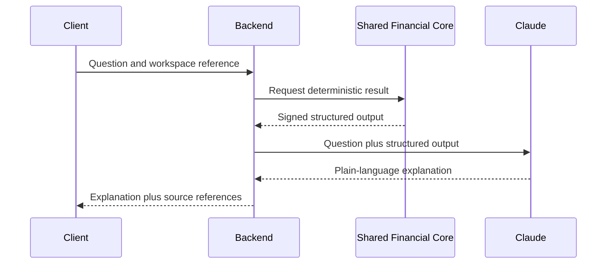

# LLM Architecture

## Rule

Claude explains structured financial output. Claude never performs financial calculations.

## Flow

## Provider Contract

`LlmProvider` exposes:

- `explainMission`
- `explainReadiness`
- `explainBlockers`
- `explainTimeline`
- `explainRecommendation`
- `answerMissionQuestion`

The Python implementation uses snake_case method names. Compatibility methods remain for the original financial-explanation routes.

## Model Strategy

| Workload | Backend model |
| --- | --- |
| Mission and readiness explanations | `claude-sonnet-4-6` |
| Open-ended mission questions | `claude-opus-4-8` |
| Quick summaries | `claude-haiku-4-5-20251001` |

`AnthropicLlmProvider` uses the Messages API and supports an injected transport for deterministic tests.

## Guardrails

- No client-side API key
- No prompt containing credentials or raw access tokens
- Structured values are immutable prompt inputs
- System instruction forbids calculation and financial advice
- Prompt/model versions are logged in future audit events
- Evaluation fixtures verify number preservation, grounded claims, tone, and refusal behavior
- Provider failures and malformed responses activate the local mock fallback
