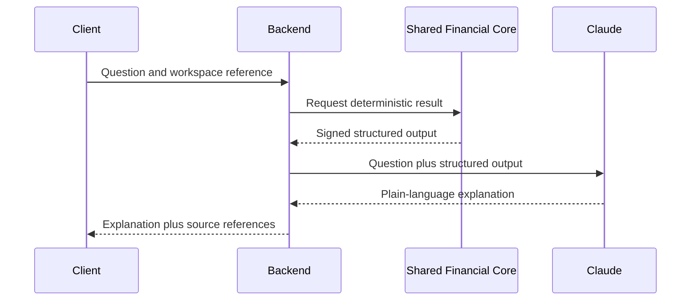

# LLM Architecture

## Rule

Claude explains structured financial output. Claude never performs financial calculations.

## Flow

## Provider Contract

`LlmProvider` exposes:

- `generateFinancialExplanation`
- `generateScenarioAnswer`
- `generateInsightSummary`

Version 2 includes `MockLlmProvider` and a non-transport `AnthropicLlmProvider` request builder.

## Model Strategy

| Workload | Strategy |
| --- | --- |
| Default financial explanation | Claude Sonnet |
| Complex scenario reasoning | Claude Opus |
| Short insight summary | Claude Haiku |

The concrete model identifier should be configured and versioned on the backend when transport is enabled.

## Guardrails

- No client-side API key
- No prompt containing credentials or raw access tokens
- Structured values are immutable prompt inputs
- System instruction forbids calculation and financial advice
- Prompt/model versions are logged in future audit events
- Evaluation fixtures verify number preservation, grounded claims, tone, and refusal behavior
