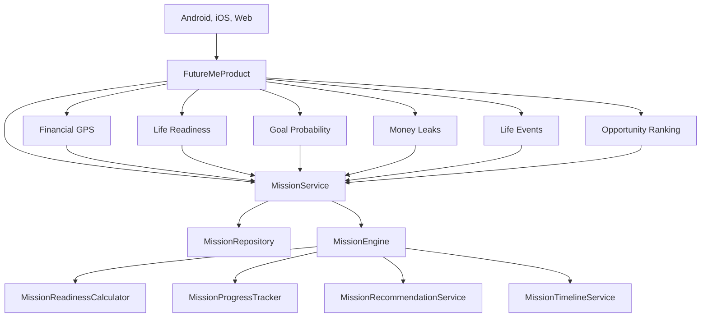

# Mission Control Architecture

Mission Control is the application layer above FutureMe's deterministic financial engines.

## Responsibilities

- `MissionRepository` defines the canonical mission portfolio and links each mission to readiness, goal, life-event, and scenario identifiers.
- `MissionReadinessCalculator` turns shared financial outputs into six explainable readiness dimensions.
- `MissionProgressTracker` calculates progress, status, and risk.
- `MissionRecommendationService` chooses one mission-specific highest-impact action.
- `MissionTimelineService` projects the five required mission horizons.
- `MissionEngine` assembles one complete mission.
- `MissionService` assembles Mission Control and Mission Analytics.

## Product Bootstrap

`ProductBootstrap` carries:

- `missions`
- `missionControl`
- `missionAnalytics`

All three clients render these shared models. Platform code does not calculate mission scores, actions, or timelines.

## AI Boundary

FutureMe Mission Coach receives missions, Mission Control, and Mission Analytics in `FinancialCopilotContext`. It can explain blockers, priorities, risks, actions, and timelines. It cannot replace the shared calculations.

## Supporting Services

The previous dashboard modules remain available for evidence and deeper exploration. They are intentionally secondary to Mission Control and are hidden behind supporting-services navigation on the primary experience.
